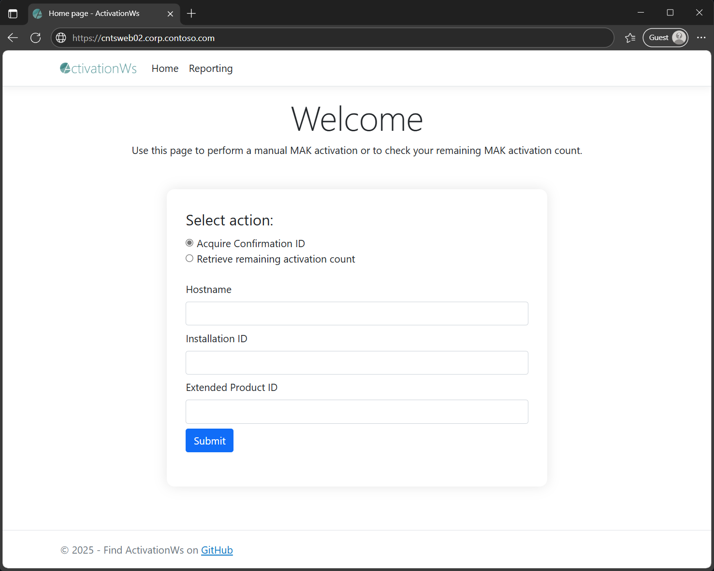

Welcome to the ActivationWs GitHub repository!

## Overview
ActivationWs is a customizable solution that allows you to automate the Multiple Activation Key (MAK)[^1] activation process for various Microsoft products, like Windows, Office, and Extended Security Update (ESU) add-ons.
[^1]: MAKs are interchangeably referred to as product keys, or license keys

Key benefits:
- Helps organizations of any size with the deployment of MAKs
- Provides a pull-based activation solution and reduces obstacles faced during product activation
- Easy to implement, time-saving, allows you to ensure business goals are realized, manages risks and delivers business value
- Customizable and addresses privacy concerns, as the source code is available to the public

[Requirements](#requirements) | [Installation and Usage](#installation-and-usage) | [FAQ](#faq) | [Contribution](#contributions-are-welcome)

## How does ActivationWs work?
ActivationWs is made up of two components: an ASP.NET web service and a PowerShell script to install the MAK and activate the product.

The following illustration shows a simplified version of the MAK deployment and product activation process:


Activation steps:
1. The PowerShell script `Activate-Product.ps1` is deployed to your devices using ConfigMgr or a deployment tool of your choice
2. The script installs the MAK and queries the respective Installation- and Product IDs. It then sends the data to the ActivationWs web service. Communication between the device and the ActivationWs web service takes place over a port of your choice, eg. 80/443
3. Installation- and Product IDs are transmitted to the Microsoft BatchActivation Service
4. A Confirmation ID is subsequently returned to the ActivationWs web service
5. ActivationWs web service returns the Confirmation ID to the device. The script deposits the Confirmation ID and concludes the product activation

## Requirements
- ActivationWs web service runs on IIS and requires
  - the .NET Framework 4.6 and ASP.NET modules
  - access to the Microsoft BatchActivation Service (`https://activation.sls.microsoft.com`). A proxy server can be specified in the web.config file, where necessary
- `Activate-Product.ps1` requires Windows PowerShell 3.0 or later and needs to be executed with administrative rights

## Installation and Usage
This section highlights some of the most frequent scenarios and guides you through the initial setup.

### Steps to deploy the ActivationWs web service:
1. Build the solution (Visual Studio 2019 or later)
2. Deploy the ActivationWs web service to IIS

### Scenario 1: Automated activation
After you have deployed ActivationWs web service to IIS, deploy the PowerShell script `Activate-Product.ps1`.

The following animation demonstrates the MAK installation and activation of an ESU product:


> [!NOTE]
> For the deployment of ESU MAKs, please ensure that these prerequisites are met on your devices:
> * [Prerequisites for Windows 10](https://learn.microsoft.com/en-us/windows/whats-new/extended-security-updates)
> * [Prerequisites for Windows Server 2012/2012 R2](https://support.microsoft.com/en-us/topic/kb5031043-procedure-to-continue-receiving-security-updates-after-extended-support-has-ended-on-october-10-2023-c1a20132-e34c-402d-96ca-1e785ed51d45)
> * [Prerequisites for Windows 7 and Windows Server 2008/2008 R2](https://techcommunity.microsoft.com/t5/windows-it-pro-blog/obtaining-extended-security-updates-for-eligible-windows-devices/ba-p/1167091#)


### Scenario 2: Manual activation

ActivationWs also supports you in the activation process for air-gapped devices, offering a time-saving alternative to calling the Volume Licensing Activation Center.

Activation steps:
1. Open the ActivationWs site
2. Enter the Installation- and Product IDs to retrieve the corresponding Confirmation ID
3. Activate the product by `slmgr.vbs /atp <Confirmation ID> <Activation ID>`



## FAQ

>[!TIP]
>The following section contains answers to frequently asked questions. Please feel free to file an [issue](https://github.com/dadorner-msft/ActivationWs/issues) or [contact me](https://github.com/login?return_to=https%3A%2F%2Fgithub.com%2Fdadorner-msft) should you have any question or need support.

### To which external addresses does ActivationWs web service specifically need access to?

ActivationWs web service requires access to the URL listed in the [Requirements](#requirements) section.

### After successfully activating the ESU product using ActivationWs, how can I verify the deployment of the Extended Security Updates?

Please take a look at [this blog article](https://techcommunity.microsoft.com/t5/windows-it-pro-blog/obtaining-extended-security-updates-for-eligible-windows-devices/ba-p/1167091#), which outlines the available updates to verify the deployment.

### Activate-Product.ps1 fails with an error

| Error | How to fix it |
|:---|:---|
| The product key is invalid | - Check your MAK<br>- For the deployment of ESU MAKs only: ensure that all of the [prerequisites](#scenario-1-automated-activation) are installed on your ESU eligible device<br> <br>If it fails even though you followed these steps, please take a look at the following support article: [How to rebuild the Tokens.dat file when you troubleshoot Windows activation issues](https://support.microsoft.com/en-us/help/2736303) |
| The Installation ID (IID) and the Confirmation ID (CID) do not match | For the deployment of ESU MAKs only: ensure that all of the [prerequisites](#scenario-1-automated-activation) are installed on your ESU eligible device |
| (500) Internal Server Error | This is a "server-side" error, meaning that the ActivationWs web service couldn't acquire the Confirmation ID. Reasons include:<br>- The ActivationWs web service couldn't connect to the [required URL](#requirements)<br>- No activations are left on your MAK. Check the remaining activation count<br>- The specified WebServiceUrl is incorrect |

### No activations are left on my MAK.
Please contact [Volume Licensing Support](https://learn.microsoft.com/en-us/licensing/contact-us)

### We're using SCCM to deploy your script. Is there a way to obfuscate or hide the MAK in the ConfigMgr logs?

You could create a task sequence (TS) variable that contains the MAK. Then modify the PowerShell script `Activate-Product.ps1` to not output the MAK and create an instance of a COM object that represents the TS environment to read the variable, eg.

```powershell
$tsEnv = New-Object -COMObject Microsoft.SMS.TSEnvironment
$productKey = $tsEnv.Value("PKEY")
```
This would prevent the MAK from showing up in the ConfigMgr log files.

## Contributions are welcome

You don’t have to be a developer to contribute to the project!

There are other ways to join the project including:

1. Writing documentation
2. Creating tutorials
3. Bug reporting and triaging ([here](https://github.com/dadorner-msft/activationws/issues/new/choose))
4. Feature testing

<br />

[Back to Overview](#overview)
